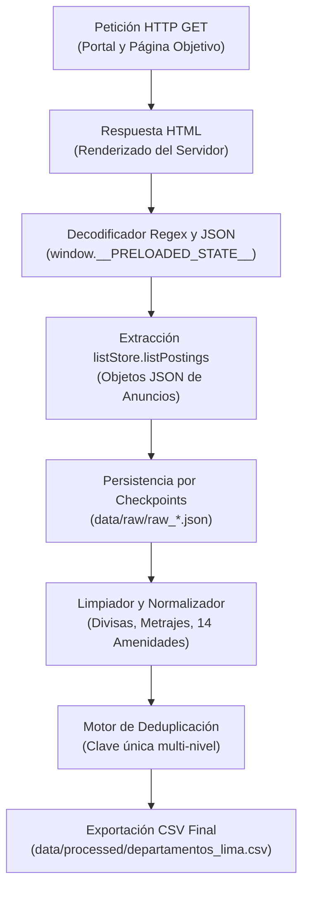

# Protocolo y Metodología de Adquisición de Datos

## 1. Resumen y Fuentes de Información

Este documento describe el proceso integral de adquisición y extracción de datos utilizado para construir el dataset maestro **`departamentos_lima.csv`**, el cual recopila ofertas de departamentos tanto en modalidad de **Venta (Compra)** como de **Alquiler (Renta mensual)** en los distritos de Lima Metropolitana y el Callao, Perú.

Las fuentes primarias seleccionadas son los dos portales inmobiliarios líderes del mercado peruano:
1. **Adondevivir** (`https://www.adondevivir.com`)
2. **Urbania Perú** (`https://urbania.pe`)

Juntos, estos portales concentran más del 75% de la oferta inmobiliaria formal con alta intención transaccional en Lima.

---

## 2. Arquitectura de Scraping y Estrategia Técnica

Ambos portales están desarrollados sobre la arquitectura del grupo **Navent**, la cual inyecta los datos de los inmuebles renderizados en el servidor (*Server-Side Rendering - SSR*) dentro de una etiqueta `<script>` en el HTML bajo la variable global `window.__PRELOADED_STATE__`.

### Pilares Técnicos de la Extracción:
1. **Extracción Directa del Estado JSON**: En lugar de utilizar selectores CSS del DOM (los cuales son frágiles y cambian frecuentemente), el scraper extrae directamente la base de datos JSON embebida en la página. Esto garantiza un **100% de integridad estructural** y máxima velocidad.
2. **Mapeo de Etiquetas de Características (CFT)**:
   * `CFT100`: Área total del inmueble ($m^2$) $\rightarrow$ `area_total`
   * `CFT101`: Área techada / construida ($m^2$) $\rightarrow$ `area_construida`
   * `CFT2`: Número de dormitorios $\rightarrow$ `dormitorios`
   * `CFT3`: Número de baños $\rightarrow$ `banos`
   * `CFT7`: Número de estacionamientos $\rightarrow$ `estacionamientos`
   * `CFT6`: Número de piso $\rightarrow$ `piso`
   * `CFT5`: Años de antigüedad $\rightarrow$ `antiguedad`
3. **Scraping Ético y Prevención de Bloqueos**:
   * Rotación de encabezados de navegador (*User-Agent* de navegadores modernos).
   * Intervalos de espera controlados (1.0 a 1.3 segundos por página).
   * Algoritmo de reintentos con *Exponential Backoff* (hasta 3 intentos automáticos por página si ocurre un fallo de red).
4. **Tolerancia a Fallos e Instantáneas (Checkpoints)**:
   * Los registros en crudo se guardan en snapshots JSON dentro de `data/raw/` cada 25 páginas para garantizar que ningún dato se pierda ante cortes de energía o conexión.